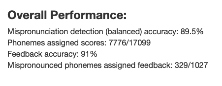
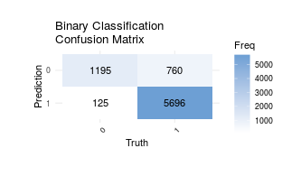
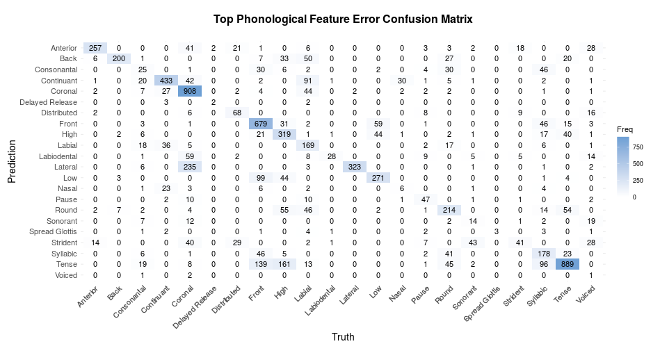
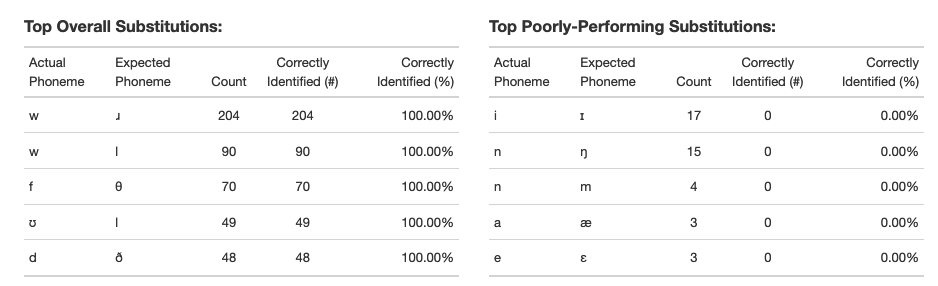
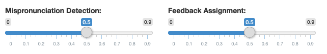
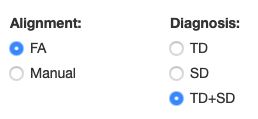

```{r include=FALSE}
library(tidyverse)
library(readr)
```


```{r, echo = FALSE, fig.width=11}
knitr::include_url('https://amie-roten.shinyapps.io/Data_Exploration_Phonological_Features/', height = '800px')
```

A preliminary note: If the visualization above does not render well on your machine, please visit the application directly, at https://amie-roten.shinyapps.io/Data_Exploration_Phonological_Features/ !

## Overview

The interactive visualization above was created primarily as a final project submission for OHSU's Data Visualization course, but also as a tool to guide investigation of data from a research project I've been working on during my time at OHSU. So, in that sense, this is a bit of a version 1.0, and I plan to keep modifying and updating it as different analyses are required, or certain analyses are found to be more or less usful than others! In addition to building the visualization for these purposes, I also wanted an excuse to play around more with R's Shiny package, as I think it's a very cool tool for building interesting, dynamic visualizations! 

For a brief overview, please to check out a short presentation about the visualization below:


If you'd like more specific, in-depth details, including how I went about building this visualization, read on!

## Data

As mentioned, the data used to build this visualization comes from a research project I've been a part of for the last academic year, in which we've built a prototype automatic pronunciation assessment system designed for children with speech sound disorders. The system takes in speech as an audio signal, maps each individual frame to a phoneme (aka speech sound, such as 'sh'/ʃ) as well as a set of phonological features, for example, "voiced", "coronal", etc. Then, the mapped phonological features are passed through an additional model, which predicts whether the uttered phoneme from which the feature predictions came was correctly or incorrectly pronounced. In addition to the binary pronunciation judgement, the model also predicts the most-likely phonological feature error contributing to a phoneme being deemed mispronounced, to ultimately be used as corrective feedback for the user of the system, e.g. "this phoneme was unvoiced!". 

Additionally, for both overall mispronounciation detection and feedback, the user can select a threshold used to determine whether to pass judgement on a particular phoneme. That is, while the system can provide a binary judgement in the form of a zero (mispronounced) or one (correctly pronounced) on whether the phoneme was mispronounced for all input, the raw data output by the model is in the form of a probability of whether the phoneme was correctly pronounced, which we refer to as a "confidence level". The higher the threshold chosen, the more selective we can be about which phonemes we deliver feedback on. For example, the system may report a phoneme as mispronounced, but if it is only 20% confident, we may not want to deliver feedback to the user, as users can be discouraged and confused if they are told that they have mispronounced a sound when they have not. The confidence level for the feedback assigned can also be adjusted.

As you can tell, this model generates *quite* a lot of data during various phases, and metrics to evaluate the performance of the model, such as accuracy, can differ based on how the data is thresholded. In addition, we evaluated the model using both typically-developing (TD) and speech-disordered (SD) children's speech, so it would be handy to be able to quickly take a look at how the model performance may differ depending on group. Finally, we assessed the model's performance using data that has been manually segmented into phonemes, as well as data that was force-aligned. We expect that performance would differ based on the segmentation method as well. 

With all of these ways to drill down into the data, I wanted to create a dashboard where the user could ask a question about the dataset, quickly select the subset of interest, and get a report of the model's performance for that particular subset. After learning about R's Shiny library in OHSU's Data Visualization class, I figured this would be an excellent tool for creating a dashboard to explore this dataset! Spoiler alert -- it is!

I've included a glimpse of the dataframe generated by the model below, demonstrating just how much information we were dealing with:

```{r message=FALSE, warning=FALSE}
data <- read_csv("data/phono_data_FA.csv") %>%
        mutate(X1 = NULL)
glimpse(data)
```

As you can see, each row corresponds to an actual, uttered phoneme, and includes attributes such as what phoneme was expected to be produced, what the human-assigned score was, what the machine predicted score was, and so on. 

## Audience

My goal was to create a way for a user to dig deeper into this dataset than what a single, static visualization could allow. At this point, the model is still in prototype mode, and there are many questions to be answered and knobs to tweak before unleashing this system on the world. So, I designed the dashboard specifically with members of the lab in mind, as well as potentially outside researchers who have dealt with this type of system and data before. Admittedly, this is a visualization with a lot more information on it than most not associated with this project would need, or even want. However, given the stage of the project, including as much information as possible was my goal, in order to uncover any potential problems or nuances of the system to continue to tweak during development.

I would like to rethink the visualization at some point to be more digestable for a general audience, as I'm pretty proud of this project and would love to share it with a wider set of people. However, at this point, a highly-detailed dashboard with as much information as possible (while still being as aesthetically-pleasing and non-chaotic as could be) was my goal!

## Type

As far as categorizing this visualization, it's a bit difficult to narrow it down to one, particular type of graph/chart. If forced, I'd say it's a "data dashboard", of the like often seen these days to share information about the ongoing pandemic, or which might be used by a company to monitor various aspects of their business. These are often created so that a user can explore a large dataset, or multiple datasets, and find specific answers to targeted questions. 

The overall dashboard contains a number of different types of visualizations, including confusion matrices, tables, and a bar chart. I aimed to keep the individual visualizations simple and straightforward to take in, considering there are multiple on the same page. While tables and bar charts are relatively common, straightforward methods of plotting data, confusion matrices may be a bit less well-known. While these visualizations are used in a number of research/academic settings, they are perhaps most often used to describe the performance of a classification algorithm, as in the case of this visualization. Although we can describe performance of a system in terms of overall accuracy, a confusion matrix allows the reader to assess system performance for each particular group/class. For example, we may want to know how well this system accurately identifies incorrectly pronounced phonemes, or how often phonemes pronounced correctly are falsely labeled incorrect. A confusion matrix helps answer these questions in a (more-or-less) straight-forward manner by plotting each possible ground-truth and predicted label combination, and giving the counts for each combination. The left-upper to right-lower diagonal indicates correct predictions, and the other boxes are incorrect predictions. Although it may take some practice to get familar with these visualizations, they're very handy for fine-grained assessments of a classifier's performance!

## Reader's Guide

If you've made it this far, I'll assume that you're interested in getting a bit more detail about just how to use this visualization! Although I mentioned that my audience is primarily those already familiar with the data, this is not entirely true...with a bit of explaination, I think anyone could play around with this dashboard and make some interesting observations.

So, with the basics of the data as described above in mind, I'll begin by describing each element of the dashboard, starting from the left column and continuing counterclockwise. For now, please ignore the sliders and buttons (I know, it's hard!).

### Basic Metrics
<center>

</center>

The element above is pretty straightforward -- this is just some text that reports a couple of basic metrics about the data. The most basic, perhaps, is the overall mispronunciation detection accuracy, although it is important to note that we use balanced accuracy for this dataset. That is, instead of computing it using the typical accuracy formula:

$$accuracy=\frac{total\text{ }correct}{total\text{ }examples}$$

...it is calculated using the *average* of the accuracies for each *individual* class, as in the formula below:

$$balanced\text{ }accuracy=\frac{1}{2}\left(\frac{total\text{ }mispronunciations\text{ }predicted\text{ } correctly}{total\text{ }mispronunciations}+\frac{total\text{ }correct\text{ }pronunciations\text{ }predicted\text{ } correctly}{total\text{ }correct\text{ }pronunciations}\right)$$

Wow, that's a wordy equation! For a less-specific, more technical discussion of balanced accuracy, please check out [this article](http://mvpa.blogspot.com/2015/12/balanced-accuracy-what-and-why.html).

Basically, this is used when a dataset has an imbalanced number of examples in each class, so that the accuracy of the model on one particular class does not overwhelm the others. We have a lot more correct pronunciations than mispronunciations in this dataset, which is why this is the metric we are using!

The basic metrics section also reports on how many phonemes are assigned scores, therefore are used in the calculation of accuracy. The more strict a threshold chosen, the fewer phonemes are assigned scores...I will discuss this a bit more when I review the sliders and buttons. The number on the left is the total phonemes scored, and on the right is the total number of phonemes in the dataset, giving the proportion of how many phonemes were scored.

The dashboard also reports (standard) accuracy for the phonological feature feedback. This is a bit complicated, but essentially, each phoneme has a set of expected phonological features expected to be present when that phoneme is realized in speech. A pronunciation error occurs when a realized phoneme does not match the phoneme expected, for example, someone may "fum" instead of "thumb", substituting the "f" sound for the "th" sound. In this case, there are certain phonological features expected to be present or absent in the "th" sound that differ from the expectations for the "f" sound. If the system predicts a top error as one of the discrepancies between the actual and expected phoneme, we consider that a "correct" prediction, otherwise it is incorrect. From this information, we can calculate the feedback accuracy, however, it is important to note that feedback performance is only assessed for mispronounced phonemes which the system correctly identifies as mispronounced. In addition, the proportion of these phonemes that are assigned feedback is reported, in the same fashion as the proportion of phonemes assigned scores. 

### Binary Confusion Matrix
<center>

</center>

Although the confusion matrix was discussed briefly above, I'll give a few more details here of how to go about reading this particular example. As labeled, the $x$-axis corresponds to correct, ground-truth labels, and the $y$-axis to the model-predicted labels. So, the top-left box corresponds to true negatives, or mispronounced phonemes correctly identified as mispronounced, whereas the bottom-left box corresponds to false positives, or mispronounced phonemes falsely identified as correctly pronounced. The upper-right box corresponds to false negatives, and the lower-right to true positives, defined as correctly pronounced phonemes mislabeled and correctly labeled, respectively. 

In this particular example, we can see that the majority of the examples are correctly labeled, however we do have 125 false positives, and 760 false negatives. The model still has room for improvement!


### Phonological Feature Confusion Matrix
<center>

</center>

Wow, this is quite the figure! The general idea behind this figure is exactly the same as the figure depicted/described in the previous section, only we have many, many more classes here. Again, the upper-left to bottom-right diagonal corresponds to top phonological feature errors that were correctly identified by the model, and the other boxes to incorrect guesses. As we can see (if we squint!), we can make a number of observations about the model's performance using this plot, for example, for the "coronal" feature, the system identifies this correctly a good portion of the time (908 times, to be exact), but does rather commonly mistakenly predict "lateral" as the top error when it should be "coronal". Does this make sense? Well, we can consider what these features really mean: "coronal" refers to a sound which is articulated using the tip/blade of the tongue, specifically referring to the place of articulation, and "lateral" refers to sounds in which the center of the tongue contacts the roof of the mouth, so the flow air is forced through the sides of the vocal tract. So, it does seem reasonable that the model would get these somewhat similar qualities "confused"...interesting! As you can see, while this figure has a lot going on, close inspection can be rewarded with fascinating insights.


### Feature-Level Accuracy for Phonological Feedback
<center>

</center>

One may also be interested the overall accuracy of the for individual phonological features...well, here is the plot to answer all of those questions! This is a fairly simple bar chart, where each phonological feature that was predicted as an error in the current data subset is on the $x$-axis, and the percentage of instances where it was correctly predicted is on the $y$-axis. Using this plot, we can carefully determine whether the system performs better on certain phonological features than others, which may inform how to tweak the system or balance the input data in the future. We can see here that the system performs well on the "lateral" feature, but not so well on the "round" feature.

For this type of analysis, it's also important to know how many times each feature occured -- a feature with 100% accuracy, but only one example, tells us much less than a feature with 97% accuracy over 100 examples. So, the frequency of each feature is listed under it's label, and the features are arranged going left-to-right from most to least occurances.

### Top Substitutions
<center>

</center>

Finally, there are a couple of tables reporting on the most frequent, specific phoneme substitutions in the dataset, as well as how accurately the model predicts them to be mispronounced. This, like the phonological feature confusion matrix, allows for detailed analyses of the model's performance, for example, that commonly occuring substitutions are, fortunately, correctly identified most, if not all, of the time. It is important, though, to examine pairs for which the model does not perform well, as can be seen in the table on the right. Although some of these phonemes are quite seldom-occuring, it's interesting to note that three of the pairs are vowel errors, and two are nasal consonont errors. Perhaps these are difficult problems for the model, in a larger sense. Certainly, this information can guide further analyses and questions about the model's performance, and the data itself.


### Now, to click the buttons and move the dials!

Finally, the interactive part! 

<center>

</center>

There are several elements that can be adjusted in this dashboard, to examine certain subsets of the data. First, there are two sliders that can be used to adjust the confidence level thresholds used to determine which phonemes to deliver binary feedback on, as well as which mispronounciations to provide feature feedback for. As alluded to previously, the higher the threshold value, the stricter the system is, and the fewer phonemes are assigned feedback. 

This thresholding impacts the entire dashboard, as it limits the data used to generate the figures to just the phonemes that satisfy these threshold requirements. As expected, a lax mispronunciation detection threshold of 0.2, or a minimum required confidence of 20%, will assign feedback to many phonemes, but may result in lower accuracy, whereas a strict threshold of 0.7 will only assign feedback for examples which the system is 70% "confident" in its decision (please excuse the anthropomorphization!), hopefully resulting in higher accuracy. Similar logic applies for the feedback assignment thresholding. Playing with different combinations help the user uncover yet more about the behavior of the system, and how it may be best utilized in practice.  
<center>

</center>

Finally, the user can decide whether they would like to work with the force-aligned, or manually segmented data, as well as subset it based on speaker's diagnosis (again, TD refers to "typically-developing" and SD to "speech-disordered). 

I encourage you to play around with the data, and please let me know if you uncover anything particularly interesting!


## Aesthetic Choices

My main goal when considering the aesthetics of the visualization was to make it as calm and easy to digest as possible, to offset the large amount and wide variety of information present. Although we learned a lot of neat tricks in this class to customize color palettes and fonts, I ended up taking a "less is more" approach in this particular case. 

Specifically, I decided to continue with Shiny's default color and font choices, and propogate them into the rest of the content. For the most part, this didn't require much modification, other than changing some font sizes in the figures to better match those in the Shiny h*() elements, and pulling the pretty default blue used in the Shiny sliders/buttons into the plots. 

The tricker part was arranging the widgets/plots in the overall dashboard. I spent *a lot* of time thinking through the best/most aesthetically pleasing way to arrange everything on the page, which had to be torn down and built back up several times as I added elements. I ended up arranging the page into three main sections; a bar across the top with the title, description, and toggles, the higher-level elements, and two evenly-sized columns containing the analyses. Having as few invisible "lines" breaking up the elements as possible really helped calm down the overall visual effect, in my opinion. I wish I had more to say about aesthetics, as it was something I put a lot of thought in to, but it manifested in a very simple way! I suppose I did use the lovely "theme_minimal()" option on my plots, but otherwise, I kept it clean and basic for a reason.

## Methods

Now, on to methods. I began by briefly contemplating what I wanted to include in the dashboard, and then proceeded to dive right in, without thinking too much about aesthetics or layout at the outset. I ended up with an early version that looked something like this:

<center>

</center>

I wasn't happy with the layout at this point, it felt sort of uneven and clunky, with the bar chart front and center, and I didn't feel like it deserved that much real estate. It was starting to get a little bit tricky to continue adding on additional subfigures, particularly knowing that I would have to rearrange eventually. It's a somewhat challenging to arrange widgets in a Shiny application, especially without having a very solid plan of what the final layout would be, so I went, quite literally, back to the drawing board:

<center>

</center>

I knew I wanted to have an even split down the middle of the page as much as possible, with a cohesive bar across the top with the higher-level details/interactive elements. Drawing it out really helped plan how to set up the fluidRow() functions in the ui() portion below, as some nesting was required. Thinking and planning it out before coding it up made the process much smoother. 

Although I did end up switching around the placement of a few elements, primarily reversing the placement of the two columns, the final product's layout ended up very similar to my outlined vision!

I've included the code corresponding to the final version below, with a few comments and details on a few of the more perplexing steps:

### Data Processing:

Below are the steps that I took to preprocess my data after it was generated by the pronunciation analysis system. I do want to note that the raw form pulled into R, shown in the `glimpse()` output in the Data section above, had already been preprocessed to a certain extent in the process of being generated. However, the model and related code is all written in Python, and is somewhat complex and, really, would require a whole separate blog post to detail the process, so I'll leave those details out.

There were still a couple of steps that needed to taken to prepare the data once it was pulled into R, which can be seen in the code below. One such modification was to tackle the issue of the names of the phonological features having been pulled in as abbreviations, as that is what is used in the Python program that generated the dataset. In order to make the dashboard a bit more useful, as I would guess not many could look at these abbreviations and immediately know the feature they correspond to, I mapped each one to its full name. This required first converting the columns from factors to characters, mapping each item, and then converting them back to factors, for use in a later plot. A couple of other columns were converted from factor variables to characters, for later processing.

```{r eval=FALSE, message=FALSE, warning=FALSE, paged.print=FALSE}
library(shiny)
library(gt)
library(ggpubr)
library(tidyverse)
library(ggplot2)
library(comprehenr)
library(yardstick)

# Mapper to convert feature abbreviations to full names.
feature_mapper <- function(abbreviation) {
    full <- case_when(abbreviation == 'delrel' ~ "Delayed Release",
                      abbreviation == 'back' ~ "Back", 
                      abbreviation == 'cor' ~ "Coronal",
                      abbreviation == 'round' ~ "Round",
                      abbreviation == 'lo' ~ "Low",
                      abbreviation == 'voi' ~ "Voiced",
                      abbreviation == 'hi' ~ "High",
                      abbreviation == 'son' ~ "Sonorant",
                      abbreviation == 'syl' ~ "Syllabic",
                      abbreviation == 'labiodental' ~ "Labiodental", 
                      abbreviation == 'tense' ~ "Tense",
                      abbreviation == 'cont' ~ "Continuant",
                      abbreviation == 'pause' ~ "Pause",
                      abbreviation == 'ant' ~ "Anterior",
                      abbreviation == 'lat' ~ "Lateral",
                      abbreviation == 'front' ~ "Front",
                      abbreviation == 'nas' ~ "Nasal",
                      abbreviation == 'cons' ~ "Consonantal", 
                      abbreviation == 'lab' ~ "Labial",
                      abbreviation == 'distr' ~ "Distributed",
                      abbreviation == 'strid' ~ "Strident",
                      abbreviation == 'sg' ~ "Spread Glottis")
    return(full)
}

# Read in both datasets. Could do this dynamically, 
# but then the datasets would be repeatedly read in.
# This way it is only done once.
data_child_fa <- read.csv("data/phono_data_FA.csv") %>%
    mutate(actual_phn = as.character(actual_phn),
           expected_phn = as.character(expected_phn),
           actual_top_error = as.character(actual_top_error),
           predicted_top_error = as.character(predicted_top_error)) %>%
    mutate(actual_top_error = feature_mapper(actual_top_error),
           predicted_top_error = feature_mapper(predicted_top_error)) %>%
    mutate(actual_top_error = as.factor(actual_top_error),
           predicted_top_error = as.factor(predicted_top_error))

data_child_manual <- read.csv("data/phono_data_manual.csv") %>%
    mutate(actual_phn = as.character(actual_phn),
           expected_phn = as.character(expected_phn),
           actual_top_error = as.character(actual_top_error),
           predicted_top_error = as.character(predicted_top_error)) %>%
    mutate(actual_top_error = feature_mapper(actual_top_error),
           predicted_top_error = feature_mapper(predicted_top_error)) %>%
    mutate(actual_top_error = as.factor(actual_top_error),
           predicted_top_error = as.factor(predicted_top_error))

```


### Defining the User Interface:

Now, the trickiest part -- defining the user interface! As I mentioned above, this was a complicated process which really benefited from careful, off-line thought as to how the layout should be mapped out on the page. Though the code doesn't look like much, this was a fairly time consuming process. 

The first element is the title, which was the most straight-forward piece to add, unsurprisingly. After that, the first FluidRow element corresponds to the top row which extends across the whole page horizontally. Once I knew how I wanted this arranged, it wasn't too painful to create. It did not require any nested rows, and could simply be divided into five columns containing each element: the instructional text, taking up half of the row space, the two threshold sliders, and the two sets of radio buttons to subset the data. Changes to these input widgets are monitored by the server logic and used to update the figures/tables.

```{r eval=FALSE, message=FALSE, warning=FALSE, paged.print=FALSE}
# Define UI for application
ui <- fluidPage(
  
    # Title, at top left.
    titlePanel("Data Exploration for Mispronunciation Detection System"),
    
    # Top row.
    fluidRow(
        column(6, h5("This module allows a user to explore performance metrics 
                      for a prototype automatic mispronunciation detection system. The system scores
                      individual phonemes on overall pronunciation (correct/incorrect), and
                      assigns corrective feedback based on the most-likely phonological feature error.
                      The confidence threshold used to determine whether to assign an overall
                      score and feedback can be adjusted using the sliders on the right, higher 
                      values corresponding to higher confidence in the assessment.  
                      Phoneme alignment method and speaker diagnosis (TD: typically developing, SD:
                      speech disordered) can also be toggled.")),
        column(2, sliderInput("threshold_binary", "Mispronunciation Detection:",
                              min=0.0, max=0.90, value=0.5, step=0.05)),
        column(2, sliderInput("threshold_feedback", "Feedback Assignment:",
                              min=0.0, max=0.90, value=0.5, step=0.05)),
        column(1, radioButtons("type", "Alignment:", 
                              choices = c("FA", "Manual"))),
        column(1, radioButtons("dx", "Diagnosis:", 
                               choices = c("TD", "SD", "TD+SD"),
                               selected = "TD+SD"))),
```
  

The remainder of the code for the UI section corresponds to the two columns underneath the top row. This process was more challenging, as it required nesting rows inside of columns to get the layout set up according to the plan I'd laid out. Nesting requires first segmenting the overall `fluidRow()` element into the two columns, which are both set to be size 6 (the overall row is split into 12 sections, so each subsegment takes up half of the real estate). Then, each subsection is further divided into sections/rows. In the code for column #1, this can be seen inside of the outer column function, where there are two inner column calls, one used to display the textual performance metric output, which takes up 8 segments, or 2/3rds, of the width of this column (this corresponds to 1/2 * 2/3 = 1/3rd of the overall width of the application). The remaining third of the subsection contains the small confusion matrix. Then, for the large confusion matrix to be placed in the same column, under the items mentioned above, it is entered into the outer column function, after the inner column functions. Since this element was to take up the entire width of this subcolumn, it did not need to be placed inside of another column function.

The second column is set up very similarly, please see the comments in the code for details.

```{r eval=FALSE, message=FALSE, warning=FALSE, paged.print=FALSE}
    # Columns with figures/tables.
    fluidRow(
        # Column #1.
        column(6,
                    # Creating a nested row inside of the column.
                    column(8,
                      h3("Overall Performance:", style = "font-weight: 800"),
                      span(textOutput("mp_accuracy"), style = "font-size: 16px"),
                      span(textOutput("mp_accuracy_phonemes"), style = "font-size: 16px"),
                      span(textOutput("pf_accuracy"), style = "font-size: 16px"),
                      span(textOutput("pf_accuracy_phonemes"), style = "font-size: 16px"),
                      h2(" ")),
                    column(4,
                      br(),
                      plotOutput("phn_conf_matrix", height="150px"),
                      h2(" ")),
                    # Placing the larger confusion matrix, placed under
                    # the row created above.
                    br(),
                    br(),
                    plotOutput("pf_conf_matrix", height="500px")),
        # Column #2.
        column(6,
               # Creating a nested row inside of the column.
               column(6,
                      gt_output("top_substitutions_table"),
                      h2(" ")),
               column(6,
                      gt_output("worst_top_substitutions_table"),
                      h2(" ")),
               # Placing the feature accuracy figure under the 
               # two tables.
               plotOutput("feature_accuracy")),
    )
)

```


### Defining the Server Logic:

Finally, the server logic! Here is where the information input via the slider and button widgets above is used to generate the dynamic plots and tables, which were placed in the UI section above. Each section corresponds to one output element, placed in a reactive context which allows for the item to be updated dynamically, and inside of the reactive context is the code that generates the plot or other output. For the most part, these are simple plots/tables and are pretty self-explanatory, with most of the code simply winnowing down the data to the necessary pieces. I've added a few comments here and there on the particularly interesting details:

```{r eval=FALSE, message=FALSE, warning=FALSE, paged.print=FALSE}

server <- function(input, output) {
  
    # Text output for mispronunciation detection accuracy. This must end with a
    # string, often combining variables that dynamically update, combined with 
    # the paste() function. The renderText() function wraps this code, creating
    # the reactive context.
    output$mp_accuracy <- renderText({
        mp_data <- current_data() %>% 
                   filter(predicted_score_conf >= input$threshold_binary) %>%
                   mutate(binary_accuracy = if_else(actual_score == predicted_score, 1, 0))
        mp_data_incorrect <- mp_data %>%
                             filter(actual_score == 0)
        mp_data_correct <- mp_data %>%
                           filter(actual_score == 1)
        mp_correct_0 <- sum(mp_data_incorrect$binary_accuracy)
        mp_total_0 <- nrow(mp_data_incorrect)
        mp_correct_1 <- sum(mp_data_correct$binary_accuracy)
        mp_total_1 <- nrow(mp_data_correct)
        mp_accuracy_0 <- round(mp_correct_0/mp_total_0,2)*100
        mp_accuracy_1 <- round(mp_correct_1/mp_total_1,2)*100
        mp_balanced_acc <- round((mp_accuracy_0 + mp_accuracy_1)/2, 2)
        paste("Mispronunciation detection (balanced) accuracy: ", mp_balanced_acc, "%", sep="")
    })
    
    # Dynamic text output for proportion of phonemes assigned scores.
    output$mp_accuracy_phonemes <- renderText({
        mp_data <- current_data() %>% 
            filter(predicted_score_conf >= input$threshold_binary) %>%
            mutate(binary_accuracy = if_else(actual_score == predicted_score, 1, 0))
        mp_total <- nrow(mp_data)
        mp_overall <- nrow(current_data())
        paste("Phonemes assigned scores: ", mp_total, "/", mp_overall, sep="")
    })
    
    # Dynamic text output for feature feedback accuracy.
    output$pf_accuracy <- renderText({
        pf_data <- current_data() %>% 
            filter(predicted_score_conf >= input$threshold_binary) %>%
            filter(actual_phn != '-',
                   predicted_top_error_conf >= input$threshold_feedback,
                   actual_score == 0 & predicted_score == 0) %>%
            mutate(feedback_accuracy = if_else(predicted_top_error_validity == "True", 1, 0))
        pf_correct <- sum(pf_data$feedback_accuracy)
        pf_total <- nrow(pf_data)
        paste("Feedback accuracy: ", round(pf_correct/pf_total,2)*100, "%",  sep="")
    })
    
    # Dynamic text output for feature feedback accuracy.
    output$pf_accuracy_phonemes <- renderText({
        pf_data <- current_data() %>% 
            filter(predicted_score_conf >= input$threshold_binary) %>%
            filter(actual_phn != '-',
                   predicted_top_error_conf >= input$threshold_feedback,
                   actual_score == 0 & predicted_score == 0) %>%
            mutate(feedback_accuracy = if_else(predicted_top_error_validity == "True", 1, 0))
        pf_data_all <- current_data() %>% 
            filter(predicted_score_conf >= input$threshold_binary) %>%
            filter(actual_phn != '-',
                   actual_score == 0 & predicted_score == 0)
        pf_total <- nrow(pf_data)
        pf_overall <- nrow(pf_data_all)
        paste("Mispronounced phonemes assigned feedback: ", pf_total, "/", pf_overall, sep="")
    })
    
    # Bar chart showing individual feature accuracy.
    output$feature_accuracy <- renderPlot({
        # Dataframe including phonemes for which feedback was assigned, given
        # *binary* and *feedback* thresholds. Also ensures that the features
        # are ordered by frequency, so they are plotted in the correct order.
        pf_data <- current_data() %>% 
            filter(predicted_score_conf >= input$threshold_binary) %>%
            filter(actual_phn != '-',
                   predicted_top_error_conf >= input$threshold_feedback,
                   actual_score == 0 & predicted_score == 0) %>%
            mutate(feedback_accuracy = if_else(predicted_top_error_validity == "True", 1, 0)) %>% 
            group_by(predicted_top_error) %>%
            summarise(fb_acc = sum(feedback_accuracy),
                      fb_total = n()) %>%
            mutate(percent_correct = fb_acc/fb_total * 100) %>%
            arrange(desc(fb_total)) %>%
            ungroup() %>%
            mutate(predicted_top_error = as.character(predicted_top_error))
        
        x_labs_feature = pf_data$predicted_top_error
        x_labs_count = c(as.character(pf_data$fb_total))
        
        # Creating labels which include not only the feature name, but also the 
        # number of occurrances.
        x_labs <- to_list(for(index in seq(from = 1, to = length(x_labs_count))) 
                          paste(x_labs_feature[index], '\n', x_labs_count[index], sep = ""))
        
        pf_plot <- pf_data %>%
                   ggplot(aes(x = predicted_top_error, y = percent_correct)) +
                   geom_col(color=rgb(66, 139, 202, max=255),
                            fill=rgb(66, 139, 202, max=255)) +
                   theme_minimal() +
                   xlab("\nPredicted Top Phonological Error and # Occurrences") +
                   ylab("Percent Correct") +
                   ggtitle("Feature-level Accuracy of Assigned Phonological Feedback, by Frequency\n") +
                   theme(plot.title = element_text(size = 16, face = "bold", hjust=0.5),
                         axis.title = element_text(size = 14),
                         axis.text = element_text(size = 11)) +
                   scale_x_discrete(labels=x_labs)
        
        pf_plot
    })
    
    # Phonological feature onfusion matrix plot. This uses the *excellent*
    # yardstickr package's conf_mat() function, which creates a textual
    # confusion matrix object which can be passed into the autoplot()
    # function to create a visual confusion matrix very easily. I love this!
    output$pf_conf_matrix <- renderPlot({
        data <- current_data() %>% 
          filter(predicted_score_conf >= input$threshold_binary) 
        conf_matrix <- conf_mat(data, actual_top_error, predicted_top_error,
                                dnn=c("Prediction","Truth"))
        autoplot(conf_matrix, type="heatmap") +
          scale_y_discrete(position = "left") +
          theme_minimal() +
          scale_fill_gradient(low = "white", 
                              high = rgb(109,159,212, max=255)) +
          theme(axis.text.x = element_text(angle = 45,
                                           hjust = 1),
                legend.position = "right",
                plot.title = element_text(size = 16, face = "bold", hjust=0.5),
                axis.title = element_text(size = 14),
                axis.text = element_text(size = 11)) +
          ggtitle("\nTop Phonological Feature Error Confusion Matrix\n")
    })
    
    # Confusion matrix for binary mispronunciation detection. Uses
    # same method as above. So easy!
    output$phn_conf_matrix <- renderPlot({
      data <- current_data() %>%
        mutate(actual_score = as.factor(actual_score),
               predicted_score = as.factor(predicted_score))
      data <- data %>% 
        filter(predicted_score_conf >= input$threshold_binary) 
      conf_matrix <- conf_mat(data, actual_score, predicted_score)
      autoplot(conf_matrix, type="heatmap") +
        scale_y_discrete(position = "left") +
        theme_minimal() +
        scale_fill_gradient(low = "white", 
                            #high = rgb(66, 139, 202, max=255)) +
                            high = rgb(109,159,212, max=255)) +
        theme(axis.text.x = element_text(angle = 45,
                                         hjust = 0.5),
              title = element_text(hjust=0.5),
              legend.position = "right") +
        ggtitle("Binary Classification\nConfusion Matrix")
    })
    
    # Creating the top substitutions table. This required the 
    # render_gt() context, a special reactive context specifically
    # for using the gt library's table functions.
    output$top_substitutions_table <- render_gt({
        # Filter to actual substitutions, in total dataset.
        subs_data_raw <- current_data() %>% 
            filter(predicted_score_conf >= input$threshold_binary,
                   actual_phn != '-') %>%
            filter(actual_phn != expected_phn,
                   actual_score == 0) %>%
            group_by(actual_phn, expected_phn) %>%
            summarise(total_subs = n(),
                      num_correctly_identified = n() - sum(predicted_score),
                      percent_correctly_identified = (num_correctly_identified/n())) %>%
            arrange(desc(total_subs))
        
        subs_data_raw %>% head(n=5) %>% ungroup() %>% gt() %>%
            tab_header(title = md("**Top Overall Substitutions:**")) %>%
            fmt_percent(columns = vars(percent_correctly_identified),
                       decimals = 2) %>%
            cols_label(actual_phn="Actual\nPhoneme", 
                       expected_phn="Expected\nPhoneme", 
                       total_subs="Count",
                       num_correctly_identified="Correctly\nIdentified\n(#)",
                       percent_correctly_identified="Correctly\nIdentified\n(%)") %>%
            tab_options(heading.title.font.weight = "bolder",
                        heading.align = "left",
                        table.font.size = 13,
                        table.border.top.color = "white")
    })
    
    # Creating the top poorly-performing substitutions table. 
    # This also required the render_gt() context, but was 
    # otherwise pretty straightforward.
    output$worst_top_substitutions_table <- render_gt({
        # Filter to actual substitutions, in total dataset.
        subs_data_raw <- current_data() %>% 
            filter(predicted_score_conf >= input$threshold_binary,
                   actual_phn != '-') %>%
            filter(actual_phn != expected_phn,
                   actual_score == 0) %>%
            group_by(actual_phn, expected_phn) %>%
            summarise(total_subs = n(),
                      num_correctly_identified = n() - sum(predicted_score),
                      percent_correctly_identified = (num_correctly_identified/n())) %>%
            arrange(desc(total_subs)) %>%
            filter(percent_correctly_identified < 0.5)
        
        subs_data_raw %>% head(n=5) %>% ungroup() %>% gt() %>%
            tab_header(title = md("**Top Poorly-Performing Substitutions:**")) %>%
            fmt_percent(columns = vars(percent_correctly_identified),
                        decimals = 2) %>%
            cols_label(actual_phn="Actual\nPhoneme", 
                       expected_phn="Expected\nPhoneme", 
                       total_subs="Count",
                       num_correctly_identified="Correctly\nIdentified\n(#)",
                       percent_correctly_identified="Correctly\nIdentified\n(%)") %>%
            tab_options(heading.title.font.weight = "bolder",
                        heading.align = "left",
                        table.font.size = 13,
                        table.border.top.color = "white")
    })
    
    # A small reactive element which subsets the data according to the 
    # user's selections. Separating this out just allows for cleaner 
    # code in the sections above.
    current_data <- reactive({
      data <- if(input$type == "FA") data_child_fa else data_child_manual
      data <- if(input$dx == "TD") data %>% filter(dx == "TD") else data
      data <- if(input$dx == "SD") data %>% filter(dx == "SD") else data
    })
}

# Run the application 
shinyApp(ui = ui, server = server)

```


And that concludes the discussion of this visualization! I hope you enjoyed learning about the process, as well as the data used and the project from which it came, I certainly had fun building the application and discussing the process.


